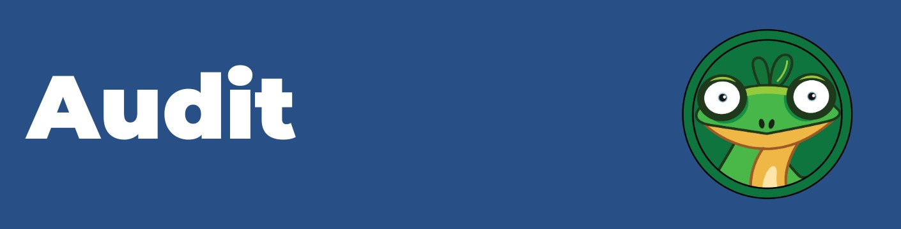

# Audit

<figure><figcaption></figcaption></figure>

Investor security is our top priority at GARY, which is why we place a great emphasis on audit verification for our project. With blockchain transactions being irreversible, we understand the importance of having secure and bug-free code. That's why we conduct thorough audits on our smart contracts to ensure they are free from vulnerabilities that could compromise investor funds.&#x20;

Our commitment to security and transparency means that we take full responsibility for the progress of the project, and we will always prioritize the safety of our investors' assets.


