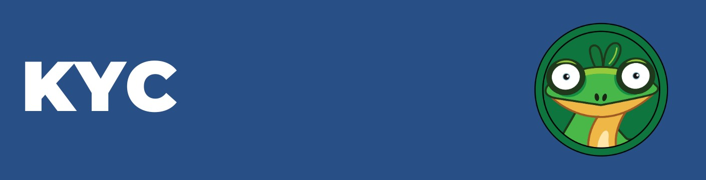

# KYC

<figure><figcaption></figcaption></figure>

Investors are increasingly aware of the importance of KYC compliance for crypto projects. At GARY, we take this responsibility very seriously, as we believe it is crucial for the preservation and growth of our investors' assets.

GARY takes full legal responsibility for the progress of the project and ensuring that we remain fully compliant with KYC regulations. This commitment to transparency & accountability is a key factor in building trust with our investors and creating a strong, sustainable community.

[KYC VERIFICATION](https://gary.cash/KYC)
